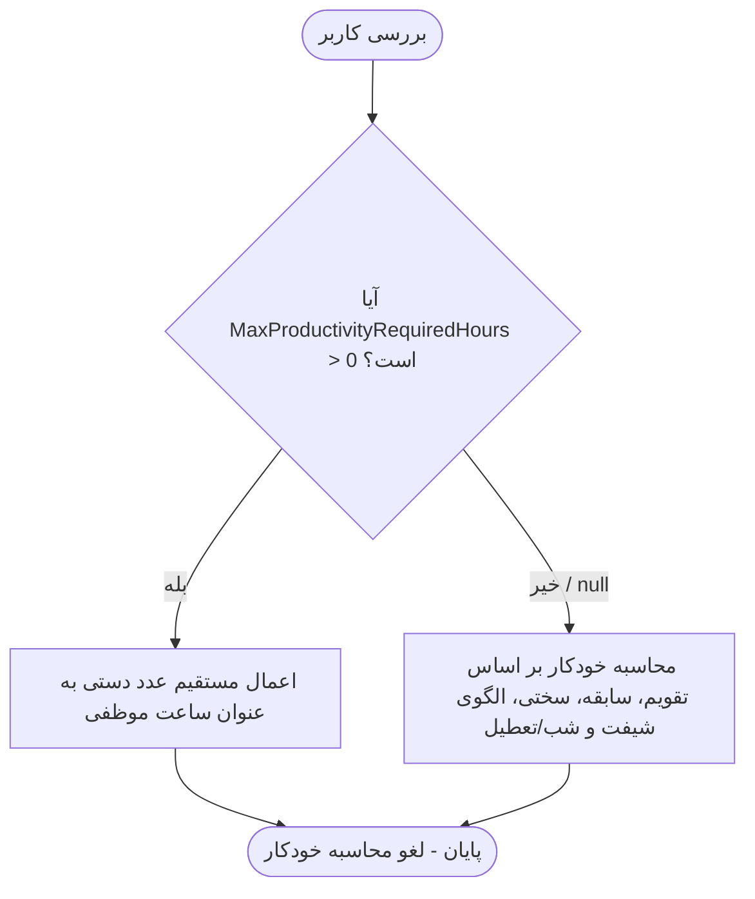

# راهنمای جامع فرآیند محاسبه ساعت موظفی پرسنل در سامانه شیفت‌یار

این سند به عنوان مرجع کامل فنی و کاربردی، فرآیند و الگوریتم‌های محاسبه **ساعت موظفی ماهانه پرسنل** را بر مبنای «قانون ارتقای بهره‌وری کارکنان بالینی نظام سلامت» و «قوانین عمومی خدمات کشوری / کار» در سامانه شیفت‌یار تشریح می‌کند.

---

## ۱. نمای کلی و فلسفه محاسبات

در سامانه شیفت‌یار، ساعت موظفی مشخص‌کننده حداقل زمانی است که یک پرسنل باید در طول ماه کاری در بیمارستان خدمت کند. محاسبات موظفی مستقیماً وارد موتورهای بهینه‌سازی شیفت‌بندی (`Simulated Annealing`, `OR-Tools`, `Hybrid`) شده و وضعیت شیفت‌های موظفی، اضافه‌کار و عدم تحقق ساعت موظفی (Shortfall) را کنترل می‌کند.

پرسنل در سیستم به دو گروه اصلی تقسیم می‌شوند:
1. **گروه اول (مشمول قانون ارتقای بهره‌وری):** کادر بالینی (پرستاران، بهیاران، ماماها، اتاق عمل، بیهوشی و ...) که مشمول کسورات سابقه، سختی کار و نوبت‌کاری و همچنین ضریب ۱٫۵ شب و تعطیل می‌شوند.
2. **گروه دوم (غیرمشمول / عادی):** پرسنل اداری، پشتیبانی یا نیروهای تحت قانون مدیریت خدمات کشوری/قانون کار که کسورات بهره‌وری ندارند و موظفی آن‌ها صرفاً ضرب روزهای کاری در ساعت موظف روزانه است.

همچنین امکان **تعیین دستی موظفی (Override)** برای هر پرسنل به صورت جداگانه پیش‌بینی شده است.

---

## ۲. فرمول‌ها و منطق محاسباتی

### ۲.۱. مبنای تقویمی ماه و ساعت کار روزانه
- **ساعت موظف روزانه پایه:** $\frac{22}{3} \approx 7.333333$ ساعت (معادل **۷ ساعت و ۲۰ دقیقه** به ازای هر روز کاری طبق قانون کار و خدمات کشوری).
- **روزهای کاری غیرتعطیل ماه:**
  $$\text{WorkingDays} = \text{TotalDays} - (\text{FridaysCount} + \text{OfficialHolidaysCount})$$
  - $\text{TotalDays}$: تعداد کل روزهای ماه (مثلاً ۳۰ یا ۳۱ یا ۲۹ روز).
  - $\text{FridaysCount}$: تعداد جمعه‌های ماه.
  - $\text{OfficialHolidaysCount}$: تعداد تعطیلات رسمی تقویمی به جز جمعه‌ها.
- **ساعت کار پایه ناخالص ماهانه و سقف ماه استاندارد:**
  - طبق قانون کار و آیین‌نامه بهره‌وری، ساعت کار هفتگی پایه ۴۴ ساعت است. یک ماه استاندارد شامل **۴ هفته کاری** معادل **۲۴ روز کاری موظف** ($4 \times 6 = 24$) و **۱۷۶ ساعت پایه** ($4 \times 44 = 176$ ساعت یا $24 \times \frac{22}{3} = 176$ ساعت) است.
  - حتی اگر در یک ماه ۳۱ روزه (مانند شهریور ۱۴۰۵) تعداد روزهای غیرتعطیل تقویم ۲۶ روز باشد، روزهای کاری موظف به **حداکثر ۲۴ روز** و ساعت پایه ناخالص به **حداکثر ۱۷۶ ساعت** سقف‌گذاری (Cap) می‌شود؛ ساعات کارکرد مازاد بر ۱۷۶ ساعت در قانون به عنوان اضافه‌کار در نظر گرفته می‌شود و جزء موظفی پایه ماه قرار نمی‌گیرد.
  $$\text{WorkingDays} = \min\Big(24\, ,\; \text{TotalDays} - (\text{FridaysCount} + \text{OfficialHolidaysCount})\Big)$$
  $$\text{BaseMonthlyHours} = \min\Big(176.0\, ,\; \text{WorkingDays} \times \frac{22}{3}\Big)$$
  - *اختیار کسر پنجشنبه‌ها:* برای مراکزی که پنج‌شنبه‌ها تعطیل اداری دارند، با فعال‌سازی `ExcludeThursdays` روزهای پنج‌شنبه نیز از روزهای کاری کسر می‌گردند.
  - *اختیار خروج از سقف:* در صورت نیاز به محاسبه صرف تقویمی (بدون سقف ۱۷۶ ساعت)، می‌توان `CapBaseHoursToStandardMonth = false` را تنظیم نمود.

---

### ۲.۲. گروه اول: پرسنل مشمول قانون ارتقای بهره‌وری

برای پرسنل مشمول، ساعت موظفی از طریق اعمال تخفیف‌های سه‌گانه هفتگی و تبدیل آن به کسر ماهانه محاسبه می‌شود:

#### ۱. کسورات هفتگی بهره‌وری (Weekly Reductions)
مجموع کاهش هفتگی از ۳ مؤلفه تشکیل می‌شود:

$$\text{WeeklyReduction} = \min\Big(8.0\, ,\; \text{SeniorityReduction} + \text{HardshipReduction} + \text{ShiftPatternReduction}\Big)$$

> **قانون سقف کاهش هفتگی:** مجموع کسورات این سه عامل در هر هفته **نمی‌تواند از ۸ ساعت تجاوز کند**.

#### ۲. تبدیل کاهش هفتگی به کاهش ماهانه
$$\text{MonthlyReductionFromWeekly} = \left(\frac{\text{TotalDays}}{7}\right) \times \text{WeeklyReduction}$$

#### ۳. اعتبار ساعات کار در شیفت‌های شب و روزهای تعطیل (Night/Holiday Credit)
ساعات واقعی کار در شیفت شب و روزهای تعطیل رسمی مشمول **ضریب ۱٫۵** است:
$$\text{NightHolidayWeightedHours} = \text{NightHolidayHours} \times 1.5$$
$$\text{NightHolidayCredit} = \text{NightHolidayWeightedHours} - \text{NightHolidayHours} = 0.5 \times \text{NightHolidayHours}$$

#### ۴. ساعت موظفی خالص نهایی ماهانه (Final Monthly Required Hours)
$$\text{FinalMonthlyRequiredHours} = \max\Big(0\, ,\; \text{BaseMonthlyHours} - \text{MonthlyReductionFromWeekly} - \text{NightHolidayCredit}\Big)$$

---

### ۲.۳. گروه دوم: پرسنل غیرمشمول (عادی / خدمات کشوری)

برای پرسنل غیرمشمول (`IsIncludedInProductivityPlan = false`):
- کسورات سابقه خدمت: ۰ ساعت.
- کسورات سختی کار: ۰ ساعت.
- کسورات الگوی نوبت‌کاری: ۰ ساعت.
- ضریب ساعات شب/تعطیل: ۱٫۰ (بدون اعتبار ۰٫۵ مازاد).
- **ساعت موظفی نهایی ماهانه:**
  $$\text{FinalMonthlyRequiredHours} = \text{BaseMonthlyHours} = \text{WorkingDays} \times \frac{22}{3}$$

---

## ۳. جداول و بازه‌های تخفیف آیین‌نامه بهره‌وری

### ۳.۱. جدول کاهش بر اساس سابقه بالینی (Seniority Reduction)

| بازه سابقه بالینی (سال) | میزان کاهش موظفی در هفته |
|:-----------------------:|:-------------------------:|
| کمتر از ۴ سال (۰ تا ۳ سال) | **۰ ساعت** |
| ۴ تا ۷ سال | **۰٫۵ ساعت** |
| ۸ تا ۱۱ سال | **۱٫۰ ساعت** |
| ۱۲ تا ۱۵ سال | **۱٫۵ ساعت** |
| ۱۶ سال و بالاتر | **۲٫۰ ساعت** (سقف سابقه) |

### ۳.۲. جدول کاهش بر اساس سختی کار بخش (Hardship Reduction)

تعیین سختی کار از دو طریق انجام می‌شود:
1. **بر اساس نوع بخش:**
   - **بخش‌های ویژه (ICU, CCU, دیالیز، سوختگی، اورژانس و روانپزشکی):** **۲٫۰ ساعت** در هفته.
   - **بخش‌های جنرال و عادی:** **۱٫۰ ساعت** در هفته (یا بر اساس درصد سختی کار).
2. **بر اساس درصد سختی کار (`HardshipPercent`):**

| درصد سختی کار | میزان کاهش موظفی در هفته |
|:-------------:|:-------------------------:|
| ۱٪ تا ۲۵٪ | **۱٫۰ ساعت** |
| ۲۶٪ تا ۵۰٪ | **۱٫۵ ساعت** |
| ۵۱٪ تا ۱۰۰٪ | **۲٫۰ ساعت** |

### ۳.۳. جدول کاهش بر اساس الگوی نوبت‌کاری (Shift Pattern Reduction)

| الگوی نوبت‌کاری (`ShiftPatternType`) | میزان کاهش در هفته | توضیحات |
|:------------------------------------:|:-------------------:|:---------|
| **ثابت روزکار** (`FixedDay`) | **۰٫۰ ساعت** | بدون کاهش نوبت‌کاری |
| **دو نوبته در گردش** (`TwoShiftRotating`) | **۰٫۵ ساعت** | گردش صبح/عصر یا عصر/شب |
| **سه نوبته در گردش** (`ThreeShiftRotating`) | **۱٫۰ ساعت** | گردش کامل صبح/عصر/شب |
| **ثابت شب‌کار** (`FixedNight`) | **۱٫۰ ساعت** | حضور همیشگی در نوبت شب |

---

## ۴. بازنویسی دستی ساعت موظفی (Manual Override)

در موجودیت کاربر (`User`) و فرم‌های پرسنل، فیلد اختیاری زیر قرار دارد:
- **`MaxProductivityRequiredHours` (اعشاری)**

### منطق تصمیم‌گیری (`ProductivityRequiredHoursResolver`):

| مقدار فیلد | رفتار سیستم |
|:-----------|:-------------|
| `null` یا `0` | ساعت موظفی به صورت خودکار با فرمول‌های بالا محاسبه می‌شود. |
| عدد مثبت (مثلاً `140`) | محاسبه خودکار نادیده گرفته شده و **دقیقاً عدد وارد شده** به عنوان ساعت موظفی ماهانه پرسنل در الگوریتم زمان‌بندی اعمال می‌شود. |

---

## ۵. اثر ساعت موظفی در زمان‌بندی و تخصیص شیفت‌ها

ساعت موظفی محاسبه‌شده (`ProductivityRequiredHours`) به عنوان پایه محاسبات موتورهای شیفت‌بندی عمل می‌کند:

### ۵.۱. تفکیک پرسنل طرحی و غیرطرحی (`ProjectPersonnelProductivityPriority`)
1. **پرسنل طرحی (`IsProjectPersonnel = true`):**
   - سقف تخصیص شیفت برای آن‌ها **دقیقاً برابر ساعت موظفی** است.
   - به هیچ عنوان اضافه کار نمی‌گیرند ($\text{MaxAllowedHours} = \text{ProductivityRequiredHours}$).
   - شیفت‌های مازاد به پرسنل غیرطرحی اختصاص می‌یابد.
2. **پرسنل غیرطرحی / رسمی / پیمانی (`IsProjectPersonnel = false` یا `null`):**
   - اولویت پر شدن موظفی با پرسنل غیرطرحی است.
   - در صورت نیاز و وجود رضایت اضافه‌کار (`OvertimeConsent = true`)، تا سقف ماهانه مجاز (پیش‌فرض ۸۰ ساعت) اضافه‌کار دریافت می‌کنند:
     $$\text{MaxAllowedHours} = \text{ProductivityRequiredHours} + \text{MaxMonthlyOvertimeHours}$$

### ۵.۲. شاخص‌های خروجی زمان‌بندی در آمار بهینه‌سازی
در خروجی اکشن‌های شیفت‌بندی (مانند `optimize-and-save`) متغیرهای زیر برای رصد موظفی تولید می‌شوند:
- `productivityRequiredHoursByUser`: هدف و کف موظفی ماهانه پرسنل.
- `productivityShortfallByUser`: میزان کسری ساعت کارکرد نسبت به موظفی (کاربر کمتر از موظفی کار کرده).
- `productivityTargetFulfillmentRate`: درصد پرسنلی که به حداقل موظفی خود رسیده‌اند.

---

## ۶. ساختار لایه‌ها و کلاس‌های کلیدی در سورس‌کد

| لایه | کلاس / مسیر | شرح وظیفه |
|:-----|:------------|:----------|
| **Domain** | `ShiftYar.Domain/Entities/ProductivityModel/ProductivityRuleConfig.cs` | نگهداری ثوابت آیین‌نامه (۴۴ ساعت، سقف ۸ ساعت، ضرایب پیش‌فرض و بازه‌ها). |
| **Domain** | `ShiftYar.Domain/Entities/ProductivityModel/StaffEmploymentInfo.cs` | انطباق داده‌های استخدامی پرسنل از موجودیت `User`. |
| **Application** | `ShiftYar.Application/DTOs/ProductivityModel/WorkingHoursCalculationRequestDto.cs` | مدل ورودی محاسبات شامل تقویم ماه، جمعه‌ها، تعطیلات و وضعیت پرسنل. |
| **Application** | `ShiftYar.Application/DTOs/ProductivityModel/WorkingHoursCalculationResultDto.cs` | مدل خروجی شامل ساعات پایه، کسورات و موظفی خالص نهایی. |
| **Application** | `ShiftYar.Application/DTOs/ProductivityModel/WorkingHoursCalculationBreakdownDto.cs` | ریز جزئیات تفکیک‌شده (کسر سابقه، کسر سختی، کسر شیفت، توضیحات متنی). |
| **Application** | `ShiftYar.Application/Interfaces/ProductivityModel/IWorkingHoursCalculator.cs` | واسط DI سرویس محاسبه. |
| **Application** | `ShiftYar.Application/Features/ProductivityModel/Services/WorkingHoursCalculator.cs` | پیاده‌سازی فرمول‌های دقیق پایه و کسورات. |
| **Application** | `ShiftYar.Application/Common/Utilities/ProductivityRequiredHoursResolver.cs` | اعمال مقدار دستی `MaxProductivityRequiredHours` یا محاسبه خودکار در قیود کاربر. |
| **Application** | `ShiftYar.Application/Common/Utilities/ProductivityWorkedHoursCalculator.cs` | محاسبه ساعت مؤثر کارکرد شیفت‌ها با احتساب ضرایب شب و روز تعطیل و ساعت تحویل کار. |
| **Application** | `ShiftYar.Application/Features/ShiftModel/SimulatedAnnealing/ProjectPersonnelProductivityPriority.cs` | اعمال تقدم غیرطرحی بر طرحی و سقف ساعات مجاز. |
| **Application** | `ShiftYar.Application/Features/ShiftModel/Services/ShiftSchedulingService.cs` | استخراج تقویم بازه، جمعه‌ها، تعطیلات و فراخوانی محاسبه در متد `LoadConstraints`. |

---

## ۷. مثال‌های عددی گام‌به‌گام

### مثال ۱: پرستار بخش ICU با ۱۰ سال سابقه در ماه ۳۰ روزه (گردشی)
- **مشخصات تقویم:** ماه ۳۰ روزه با ۴ روز جمعه و ۲ روز تعطیل رسمی وسط هفته.
  - تعداد کل روزها: ۳۰
  - روزهای کاری غیرتعطیل: $30 - (4 + 2) = 24$ روز.
- **مشخصات پرسنل:** ۱۰ سال سابقه بالینی، بخش ویژه ICU، شیفت چرخشی سه نوبته، مشمول بهره‌وری.
- **مراحل محاسبه:**
  1. **ساعت پایه ناخالص ماه:**
     $$24 \times \frac{22}{3} = 24 \times 7.333333 = 176.00 \text{ ساعت}$$
  2. **کسورات هفتگی:**
     - سابقه (۱۰ سال): ۱٫۰ ساعت
     - سختی کار (بخش ویژه): ۲٫۰ ساعت
     - الگوی نوبت‌کاری (سه نوبته): ۱٫۰ ساعت
     - مجموع تخفیف هفتگی: $1.0 + 2.0 + 1.0 = 4.0$ ساعت (کمتر از سقف ۸ ساعت)
  3. **کسر ماهانه ناشی از تخفیف هفتگی:**
     $$\frac{30}{7} \times 4.0 = 4.2857 \times 4.0 = 17.14 \text{ ساعت}$$
  4. **ساعت موظفی خالص نهایی ماه:**
     $$176.00 - 17.14 = 158.86 \text{ ساعت}$$

---

### مثال ۲: پرسنل اداری / عادی در همان تقویم (غیرمشمول)
- **مشخصات تقویم:** ۲۴ روز کاری غیرتعطیل.
- **مشخصات پرسنل:** `IsIncludedInProductivityPlan = false`.
- **مراحل محاسبه:**
  1. کسورات بهره‌وری = ۰
  2. ساعت کار پایه ناخالص: $24 \times \frac{22}{3} = 176.00$ ساعت
  3. ساعت موظفی خالص نهایی ماه: **۱۷۶٫۰۰ ساعت**.

---

### مثال ۳: پرسنل با تنظیم دستی `MaxProductivityRequiredHours`
- اگر سوپروایزر برای پرسنل مقدار `MaxProductivityRequiredHours = 145` را ثبت کرده باشد:
  - محاسبات تقویمی و کسورات سابقه و سختی نادیده گرفته می‌شوند.
  - ساعت موظفی در شیفت‌بندی دقیقاً **۱۴۵٫۰۰ ساعت** ثبت می‌شود.

---

### مثال ۴: سناریوی واقعی شهریور ۱۴۰۵ (تطابق کامل با داده‌های ثبت‌شده بیمارستان)
- **مشخصات تقویم:** ۳۱ روز کل، ۴ جمعه، ۱ روز تعطیل رسمی (۸ شهریور).
  - روزهای غیرتعطیل تقویم: $31 - (4 + 1) = 26$ روز.
  - **اعمال سقف قانونی ماه استاندارد:** روزهای موظف روی **۲۴ روز** و ساعت پایه روی **۱۷۶٫۰۰ ساعت** محدود می‌شود.
  - ضریب تخفیف ماهانه برای هر ساعت تخفیف هفتگی: $\frac{31}{7} \approx 4.42857$ ساعت در ماه.
- **جدول تطابق پرسنل بیمارستان:**

| نام پرسنل | تخفیف هفتگی | محاسبه موظفی نهایی | ساعت در سامانه (اعشاری) | ساعت واقعی بیمارستان | وضعیت تطابق |
|:----------|:------------:|:-------------------:|:------------------------:|:--------------------:|:-----------:|
| **بهار بهاری** | ۴ ساعت | $176 - (4 \times 4.4286)$ | **۱۵۸٫۲۹ ساعت** | **۱۵۸ ساعت** | کاملاً منطبق |
| **فرشته ساکی** (درخشانی، حاتمی) | ۳ ساعت | $176 - (3 \times 4.4286)$ | **۱۶۲٫۷۱ ساعت** | **۱۶۳ ساعت** | کاملاً منطبق |
| **فاطمه رضایی** (متقی، رحیمی) | ۲ ساعت | $176 - (2 \times 4.4286)$ | **۱۶۷٫۱۴ ساعت** | **۱۶۷ ساعت** | کاملاً منطبق |
| **فاطمه مدهنی** | ۱ ساعت | $176 - (1 \times 4.4286)$ | **۱۷۱٫۵۷ ساعت** | **۱۷۱ ساعت** | کاملاً منطبق |
| **مریم کرمی** (مریم امیدی و ...) | ۰ ساعت (پایه) | $176 - 0$ | **۱۷۶٫۰۰ ساعت** | **۱۷۶ ساعت** | کاملاً منطبق |

