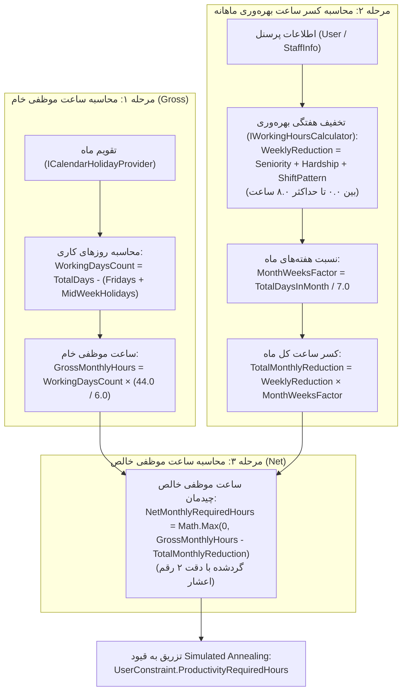
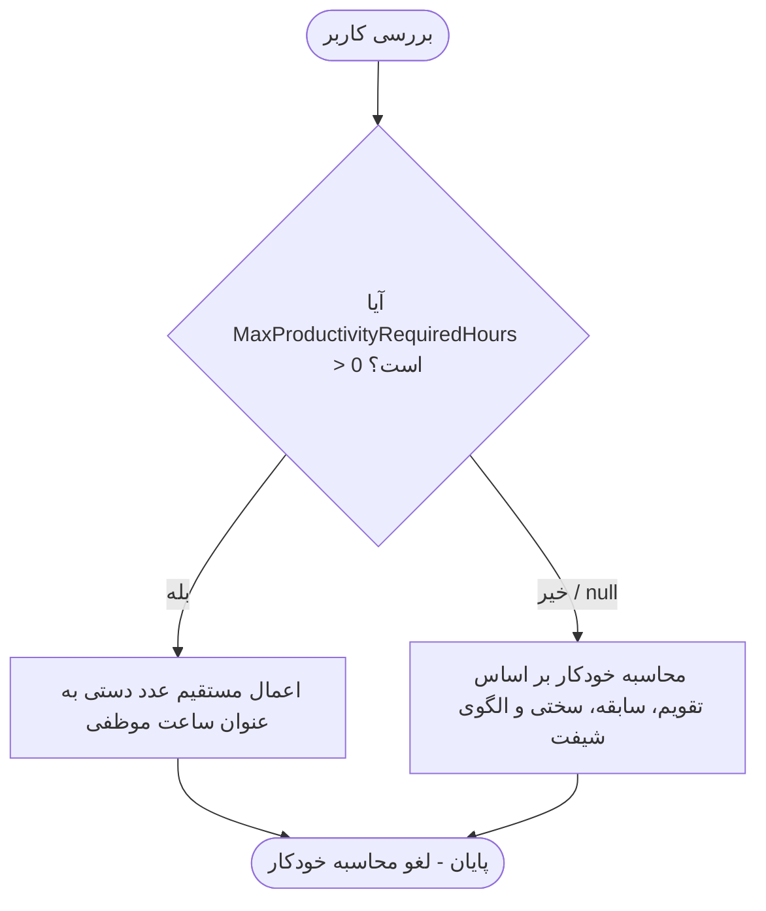

# راهنمای جامع فرآیند محاسبه ساعت موظفی پرسنل در سامانه شیفت‌یار

این سند به عنوان مرجع کامل فنی و کاربردی، فرآیند و الگوریتم‌های محاسبه **ساعت موظفی تقویمی ماهانه پرسنل درمان (Net Monthly Required Hours)** را بر مبنای «قانون ارتقای بهره‌وری کارکنان بالینی نظام سلامت» و «قوانین عمومی خدمات کشوری / کار» در سامانه شیفت‌یار تشریح می‌کند.

---

## ۱. نمای کلی و فلسفه محاسبات

در سامانه شیفت‌یار، ساعت موظفی مشخص‌کننده حداقل زمانی است که یک پرسنل باید در طول ماه کاری در بیمارستان خدمت کند. محاسبات موظفی مستقیماً وارد موتورهای بهینه‌سازی شیفت‌بندی (`Simulated Annealing`, `OR-Tools`, `Hybrid`) شده و وضعیت شیفت‌های موظفی، اضافه‌کار و عدم تحقق ساعت موظفی (Shortfall) را در قیود هارد و سافت کنترل می‌کند.

پرسنل در سیستم به دو گروه اصلی تقسیم می‌شوند:
1. **گروه اول (مشمول قانون ارتقای بهره‌وری):** کادر بالینی (پرستاران، بهیاران، ماماها، اتاق عمل، بیهوشی و ...) که مشمول کسورات سه‌گانه سابقه، سختی کار و نوبت‌کاری و همچنین ضریب ۱٫۵ شب و تعطیل در کارکرد می‌شوند.
2. **گروه دوم (غیرمشمول / عادی):** پرسنل اداری، پشتیبانی یا نیروهای تحت قانون مدیریت خدمات کشوری/قانون کار که کسورات بهره‌وری ندارند و موظفی آن‌ها صرفاً ضرب روزهای کاری تقویمی در ساعت موظف روزانه است.

همچنین امکان **تعیین دستی موظفی (Manual Override)** برای هر پرسنل به صورت جداگانه پیش‌بینی شده است.

---

## ۲. متدولوژی ۳ مرحله‌ای محاسبه ساعت موظفی تقویمی ماهانه

فرآیند محاسبه ساعت موظفی خالص ماهانه پرسنل بالینی برای یک بازه ماهانه معین (بر اساس تقویم شمسی یا میلادی) طبق مراحل زیر انجام می‌پذیرد:

---

### ۲.۱. مرحله ۱: محاسبه ساعت موظفی خام/ناخالص ماهانه (Gross Monthly Required Hours)

- **هفته کاری ۶ روزه درمان:** پرسنل بیمارستانی مشمول هفته کاری ۶ روزه هستند (پنج‌شنبه‌ها برای بخش‌های درمانی روز غیرکاری محسوب نمی‌شود).
- **ساعت کار پایه هر روز کاری:** برابر با $\frac{44.0}{6.0} \approx 7.333333$ ساعت (معادل **۷ ساعت و ۲۰ دقیقه**، حاصل از ۴۴ ساعت پایه موظفی هفتگی تقسیم بر ۶ روز کاری).
- **روزهای غیرکاری تقویمی در ماه:**
  1. تمامی روزهای **جمعه** تقویم در آن ماه.
  2. کلیه **تعطیلات رسمی تقویمی** در آن ماه (به جز جمعه‌هایی که با تعطیل رسمی همپوشانی دارند؛ نباید دوبار کسر شوند).
- **تعداد روزهای کاری ماه:**
  $$\text{WorkingDaysCount} = \text{TotalDaysInMonth} - (\text{FridaysCount} + \text{MidWeekOfficialHolidaysCount})$$
- **ساعت موظفی خام ماهانه:**
  $$\text{GrossMonthlyHours} = \text{WorkingDaysCount} \times \left(\frac{44.0\text{m}}{6.0\text{m}}\right)$$

---

### ۲.۲. مرحله ۲: محاسبه کسر ساعت بهره‌وری ماهانه (Monthly Productivity Reduction)

- **تخفیف هفتگی کاربر (Weekly Reduction):**
  با فراخوانی متد `GetWeeklyProductivityReduction(user)` مقداری بین ۰.۰ تا سقف ۸.۰ ساعت در هفته به دست می‌آید:
  $$\text{WeeklyReduction} = \min\Big(8.0\, ,\; \text{SeniorityReduction} + \text{HardshipReduction} + \text{ShiftPatternReduction}\Big)$$
- **نسبت تعداد هفته‌های ماه بر اساس طول ماه (Month Weeks Factor):**
  $$\text{MonthWeeksFactor} = \frac{\text{TotalDaysInMonth}}{7.0\text{m}}$$
  - برای ماه ۳۱ روزه: $\frac{31}{7} \approx 4.42857$
  - برای ماه ۳۰ روزه: $\frac{30}{7} \approx 4.28571$
  - برای ماه ۲۹ روزه: $\frac{29}{7} \approx 4.14286$
- **کسر ساعت موظفی در طول کل ماه:**
  $$\text{TotalMonthlyReduction} = \text{WeeklyReduction} \times \text{MonthWeeksFactor}$$

---

### ۲.۳. مرحله ۳: محاسبه ساعت موظفی خالص ماهانه (Net Monthly Required Hours)

- **ساعت موظفی نهایی و قابل چیدمان در شیفت:**
  $$\text{NetMonthlyRequiredHours} = \max\Big(0\text{m}\, ,\; \text{GrossMonthlyHours} - \text{TotalMonthlyReduction}\Big)$$
- مقدار نهایی با دقت **۲ رقم اعشار** (`Math.Round(..., 2, MidpointRounding.AwayFromZero)`) رند می‌شود.
- در کنار مقدار اعشاری، ویژگی `NetMonthlyRequiredHoursRounded` مقدار گردشده به نزدیک‌ترین عدد صحیح را برای مصارف گزارش‌گیری عمومی ارائه می‌دهد.

> **نکته معماری پیرامون ضریب ۱٫۵ شب و تعطیل (Night/Holiday Multiplier):**
> طبق نص صریح قانون ارتقای بهره‌وری، ضریب ۱٫۵ برابر ساعات شب و ایام تعطیل، پاداش عملکردی برای **«کارکرد مؤثر پرسنل»** (`ProductivityWorkedHoursCalculator`) در مرحله انتساب شیفت‌ها است، **نه کسر پیش‌دستانه از سقف موظفی ماهانه**.
> - **ساعت موظفی (Target):** تعهد کاری ماهیانه پرسنل است که بر اساس تقویم و کسورات سه‌گانه تعیین می‌شود.
> - **کارکرد مؤثر (Worked Hours):** هر ۱ ساعت حضور در شب یا روز تعطیل معادل ۱٫۵ ساعت کارکرد ثبت می‌شود؛ این امر باعث می‌شود پرسنل دارای شیفت‌های شب/تعطیل زودتر به ساعت موظفی خود برسند.

---

### ۲.۴. گروه دوم: پرسنل غیرمشمول (عادی / خدمات کشوری)

برای پرسنل غیرمشمول (`IncludedProductivityPlan = false`):
- تخفیف هفتگی بهره‌وری برابر با **۰٫۰ ساعت** است (`WeeklyProductivityReduction = 0.0m`).
- کسر ساعت ماهانه برابر با **۰٫۰ ساعت** است (`TotalMonthlyReduction = 0.0m`).
- ساعت موظفی خالص دقیقاً برابر با ساعت موظفی خام تقویمی است:
  $$\text{NetMonthlyRequiredHours} = \text{GrossMonthlyHours} = \text{WorkingDaysCount} \times \left(\frac{44.0\text{m}}{6.0\text{m}}\right)$$

---

## ۳. جداول و بازه‌های تخفیف بر اساس دستورالعمل اجرایی وزارت بهداشت

پایه ساعت کار موظف هفتگی **۴۴ ساعت** و حداکثر سقف تقلیل در هر هفته **۸ ساعت** است:

### ۳.۱. جدول کاهش بر اساس سابقه خدمت (Seniority Reduction)

| بازه سابقه بالینی / سنوات | میزان کاهش در هفته | توضیحات |
|:-------------------------:|:-------------------:|:---------|
| **۰ تا ۴ سال** | **۱٫۰ ساعت** | کلیه پرسنل بدو خدمت و طرحی نیز مشمول این بازه هستند (هرگز صفر محاسبه نمی‌شود) |
| **۴ سال و ۱ ماه تا ۸ سال** | **۲٫۰ ساعت** | |
| **۸ سال و ۱ ماه تا ۱۲ سال** | **۳٫۰ ساعت** | |
| **۱۲ سال و ۱ ماه تا ۱۶ سال** | **۴٫۰ ساعت** | |
| **۱۶ سال و ۱ ماه به بالا** | **۵٫۰ ساعت** | سقف کاهش سابقه خدمت |

> **نکته:** برای تاریخ‌های استخدام دقیق، کسر سال بر اساس ماه محاسبه می‌شود (مثلاً ۴ سال و ۱ ماه معادل ۴٫۰۸۳۳ سال و مشمول ۲٫۰ ساعت است).

### ۳.۲. جدول کاهش صعوبت و سختی کار (Hardship Reduction - حداکثر ۲٫۰ ساعت در هفته)

سامانه از دو روش ورودی **درصد** یا **امتیاز** با قاعده اعتبارسنجی انحصاری متقابل (Mutually Exclusive / XOR) پشتیبانی می‌کند:

| درصد نظام هماهنگ (`HardshipPercent`) | امتیاز مدیریت خدمات کشوری (`HardshipScore`) | میزان کاهش در هفته |
|:---------------------------------------:|:-------------------------------------------:|:-------------------:|
| کمتر از ۸٪ یا بدون مقدار | کمتر از ۰ یا بدون مقدار | **۰٫۰ ساعت** |
| **۸ تا ۲۵ درصد** | **۰ تا ۳۷۵ امتیاز** | **۰٫۵ ساعت** |
| **۲۶ تا ۵۰ درصد** | **۳۷۶ تا ۷۵۰ امتیاز** | **۱٫۰ ساعت** |
| **۵۱ تا ۷۵ درصد** | **۷۵۱ تا ۱۰۰۰ امتیاز** | **۱٫۵ ساعت** |
| **۷۶ تا ۱۰۰ درصد** | **۱۰۰۰ امتیاز به بالا** | **۲٫۰ ساعت** |

#### استثنای رده‌های مدیریت بالینی (ماده ۴ دستورالعمل وزارت بهداشت):
- کلیه **سوپروایزرها (Supervisor)**، **سرپرستاران (Head Nurse)**، **مترون‌ها (Metron)** و **مدیران خدمات پرستاری**:
  - به صورت خودکار مشمول حداکثر سقف کاهش صعوبت کار (**۲٫۰ ساعت در هفته**) می‌شوند؛ صرف‌نظر از اینکه چه درصد یا امتیازی در پرونده آنها ثبت شده باشد.
  - تشخیص رده‌های مدیریتی از طریق فلگ‌های بولین (`IsSupervisor`، `IsHeadNurse`) یا بررسی عناوین شغلی (`Position`، `JobTitle`، `Role`) به صورت هوشمند و مستقل از حروف کوچک/بزرگ صورت می‌گیرد.

### ۳.۳. جدول کاهش نوبت‌کاری غیرمتعارف / گردشی (Shift Pattern Reduction)

طبق نص صریح دستورالعمل اجرایی وزارت بهداشت:
- **کلیه پرسنل دارای نوبت‌کاری در گردش (Rotating / TwoShift / ThreeShift):** دقیقاً **۱٫۰ ساعت کسر در هفته** (بدون هیچ پیش‌شرط سابقه خدمت).
- **پرسنل با نوبت‌کاری ثابت شب:** **۱٫۰ ساعت کسر در هفته**.
- **پرسنل روزکار ثابت:** **۰٫۰ ساعت**.

---

## ۴. تأمین‌کننده تقویم و تعطیلات رسمی (`CalendarHolidayProvider`)

برای عدم هاردکد شدن روزهای تقویم و پوشش ماه‌های مختلف، کامپوننت `ICalendarHolidayProvider` وظایف زیر را بر عهده دارد:

1. **تشخیص خودکار تقویم شمسی/میلادی:**
   - سال‌های در بازه ۱۲۰۰ تا ۱۶۰۰ شمسی به عنوان تقویم هجری شمسی ارزیابی شده و طول ماه (۳۱، ۳۰ یا ۲۹ روز) دقیقاً از `PersianCalendar` استخراج می‌شود.
2. **استخراج جمعه‌ها:**
   - تمامی روزهای جمعه ماه شناسایی شده و در لیست `FridayDates` نگهداری می‌شوند.
3. **استخراج تعطیلات رسمی وسط هفته:**
   - از دیتابیس `ShiftDate`، فایل‌های منبع تقویم (`Resources/Holidays/holidays_{py}.json`) یا ورودی کاستوم واکشی می‌شوند.
   - **قاعده عدم شمارش مضاعف:** اگر تعطیل رسمی روی روز جمعه بیفتد، در شمارش `MidWeekOfficialHolidaysCount` لحاظ نمی‌شود تا از کسر دوبار روزهای کاری جلوگیری گردد.

---

## ۵. بازنویسی دستی ساعت موظفی (Manual Override)

در موجودیت کاربر (`User`) و فرم‌های پرسنل، فیلد اختیاری زیر قرار دارد:
- **`MaxProductivityRequiredHours` (اعشاری)**

### منطق تصمیم‌گیری (`ProductivityRequiredHoursResolver`):

| مقدار فیلد | رفتار سیستم |
|:-----------|:-------------|
| `null` یا `0` | ساعت موظفی به صورت خودکار با فرمول‌های تقویمی و بهره‌وری محاسبه می‌شود. |
| عدد مثبت (مثلاً `140`) | محاسبه خودکار نادیده گرفته شده و **دقیقاً عدد وارد شده** به عنوان ساعت موظفی ماهانه پرسنل در الگوریتم زمان‌بندی اعمال می‌شود (ضمن حفظ اسنپ‌شات تقویمی برای مقایسه). |

---

## ۶. یکپارچه‌سازی با الگوریتم زمان‌بندی (Simulated Annealing)

ساعت موظفی خالص تقویمی محاسبه‌شده مستقیماً ورودی توابع جریمه و محدودیت موتور بهینه‌سازی شیفت می‌شود:
- موجودیت `UserConstraint` در فضای شبیه‌سازی دارای دو فیلد کلیدی است:
  * `ProductivityRequiredHours`: مقدار نهایی هدف موظفی ماهانه (یا سقف دستی).
  * `MonthlyCalendarSnapshot`: نگهداری کل نتایج تفصیلی DTO تقویمی (`MonthlyCalendarWorkingHoursResultDto`) برای استفاده در گزارش‌ها و مصورسازی‌ها.
- **توزیع کارکرد طرحی و غیرطرحی (`ProjectPersonnelProductivityPriority`):**
  * پرسنل طرحی (`IsProjectPersonnel = true`) حداکثر تا ساعت موظفی شیفت می‌گیرند و اضافه‌کار به آن‌ها اختصاص نمی‌یابد.
  * شیفت‌های مازاد و اضافه‌کار اولویت‌دار به پرسنل غیرطرحی با رضایت اضافه‌کار تعلق می‌گیرد.

---

## ۷. ساختار لایه‌ها و کلاس‌های کلیدی در سورس‌کد

| لایه | کلاس / واسط | شرح وظیفه |
|:-----|:------------|:----------|
| **Domain** | [ProductivityRuleConfig.cs](file:///d:/Hampadco/RealProjects/ShiftYar/ShiftYar.Domain/Entities/ProductivityModel/ProductivityRuleConfig.cs) | ثوابت آیین‌نامه (۴۴ ساعت، سقف ۸ ساعت، ضرایب پیش‌فرض و بازه‌ها). |
| **Domain** | [StaffEmploymentInfo.cs](file:///d:/Hampadco/RealProjects/ShiftYar/ShiftYar.Domain/Entities/ProductivityModel/StaffEmploymentInfo.cs) | استخراج اطلاعات استخدامی، سابقه و الگوی شیفت از موجودیت `User`. |
| **Application** | [ICalendarHolidayProvider.cs](file:///d:/Hampadco/RealProjects/ShiftYar/ShiftYar.Application/Interfaces/ProductivityModel/ICalendarHolidayProvider.cs) | واسط محاسبات تقویمی ماه، جمعه‌ها و تعطیلات رسمی. |
| **Application** | [CalendarHolidayProvider.cs](file:///d:/Hampadco/RealProjects/ShiftYar/ShiftYar.Application/Common/Utilities/CalendarHolidayProvider.cs) | پیاده‌سازی سرویس تقویم با پیشگیری از شمارش مضاعف تعطیلات جمعه. |
| **Application** | [MonthlyCalendarWorkingHoursResultDto.cs](file:///d:/Hampadco/RealProjects/ShiftYar/ShiftYar.Application/DTOs/ProductivityModel/MonthlyCalendarWorkingHoursResultDto.cs) | مدل DTO تفصیلی خروجی شامل ساعات خام، کسورات و ساعت خالص ماهانه. |
| **Application** | [IWorkingHoursCalculator.cs](file:///d:/Hampadco/RealProjects/ShiftYar/ShiftYar.Application/Interfaces/ProductivityModel/IWorkingHoursCalculator.cs) | واسط محاسبات موظفی تقویمی، تخفیف هفتگی و ساعت خالص. |
| **Application** | [WorkingHoursCalculator.cs](file:///d:/Hampadco/RealProjects/ShiftYar/ShiftYar.Application/Features/ProductivityModel/Services/WorkingHoursCalculator.cs) | پیاده‌سازی متدهای `CalculateMonthlyRequiredHours` و `GetWeeklyProductivityReduction`. |
| **Application** | [ProductivityRequiredHoursResolver.cs](file:///d:/Hampadco/RealProjects/ShiftYar/ShiftYar.Application/Common/Utilities/ProductivityRequiredHoursResolver.cs) | اتصال نتایج محاسباتی به قیود الگوریتم با اعمال اولویت بازنویسی دستی. |
| **Application** | [IShiftSchedulingService.cs](file:///d:/Hampadco/RealProjects/ShiftYar/ShiftYar.Application/Interfaces/ShiftModel/IShiftSchedulingService.cs) | متد سطح ارکستراسیون زمان‌بندی `CalculateMonthlyRequiredHours(User, year, month)`. |
| **Tests** | [MonthlyCalendarRequiredHoursTests.cs](file:///d:/Hampadco/RealProjects/ShiftYar/tests/ShiftYar.Application.Tests/MonthlyCalendarRequiredHoursTests.cs) | آزمون‌های واحد جامع سناریوهای تقویمی، مقایسه ۰ در برابر ۸، نقش‌های مدیریتی و دقت اعشار. |

---

## ۸. سناریوهای عددی و اعتبارسنجی (Verified Unit Test Scenarios)

### سناریو ۱: ماه ۳۰ روزه با ۴ جمعه و ۲ روز تعطیل رسمی وسط هفته (۲۴ روز کاری)
- **مشخصات تقویم:**
  * روزهای کاری: $30 - (4 + 2) = 24$ روز کاری.
  * ساعت موظفی خام: $24 \times \frac{44}{6} = \mathbf{176.00}$ ساعت.
  * نسبت هفته‌های ماه: $\frac{30}{7} \approx 4.2857$.
- **پرسنل با ۰ ساعت کسر هفتگی (یا غیرمشمول):**
  * تخفیف ماهانه: $0.00$ ساعت.
  * موظفی خالص: $\mathbf{176.00}$ ساعت.
- **پرسنل با حداکثر ۸ ساعت کسر هفتگی (سابقه ۱۶+ سال + سختی کار + شیفت گردشی):**
  * تخفیف کل ماه: $8.0 \times \left(\frac{30}{7}\right) = \mathbf{34.29}$ ساعت.
  * موظفی خالص: $176.00 - 34.29 = \mathbf{141.71}$ ساعت.

---

### سناریو ۲: ماه ۳۱ روزه بدون تعطیل رسمی غیر از جمعه‌ها (۲۶ روز کاری)
- **مشخصات تقویم:**
  * روزهای کاری (۵ جمعه): $31 - 5 = 26$ روز کاری.
  * ساعت موظفی خام: $26 \times \left(\frac{44}{6}\right) = 190.6666... \approx \mathbf{190.67}$ ساعت.
  * نسبت هفته‌های ماه: $\frac{31}{7} \approx 4.4286$.
- **پرسنل با ۰ ساعت کسر هفتگی:**
  * موظفی خالص: $\mathbf{190.67}$ ساعت.
- **پرسنل با حداکثر ۸ ساعت کسر هفتگی:**
  * تخفیف کل ماه: $8.0 \times \left(\frac{31}{7}\right) = \mathbf{35.43}$ ساعت.
  * موظفی خالص: $190.67 - 35.43 = \mathbf{155.24}$ ساعت.

---

### سناریو ۳: مقایسه موظفی نهایی فرد دارای ۰ ساعت کسر در برابر حداکثر ۸ ساعت کسر

| نوع ماه | روزهای کل | روزهای کاری | موظفی خام (Gross) | کسر ۸ ساعت هفتگی | موظفی خالص (فرد ۰ ساعت) | موظفی خالص (فرد ۸ ساعت) | اختلاف دقیق |
|:---:|:---:|:---:|:---:|:---:|:---:|:---:|:---:|
| **ماه ۳۰ روزه** | ۳۰ | ۲۴ | ۱۷۶٫۰۰ | ۳۴٫۲۹ | **۱۷۶٫۰۰** | **۱۴۱٫۷۱** | ۳۴٫۲۹ |
| **ماه ۳۱ روزه** | ۳۱ | ۲۶ | ۱۹۰٫۶۷ | ۳۵٫۴۳ | **۱۹۰٫۶۷** | **۱۵۵٫۲۴** | ۳۵٫۴۳ |
| **ماه ۲۹ روزه (اسفند)** | ۲۹ | ۲۳ | ۱۶۸٫۶۷ | ۳۳٫۱۴ | **۱۶۸٫۶۷** | **۱۳۵٫۵۳** | ۳۳٫۱۴ |

---

### سناریو ۴: استثنای رده‌های مدیریت بالینی (ماده ۴)
- **پرسنل:** سوپروایزر با ۲ سال سابقه (بازه ۰ تا ۴ سال = ۱ ساعت سنوات)، بدون ثبت درصد یا امتیاز سختی کار، شیفت ثابت روز (۰ ساعت نوبت‌کاری):
  * سنوات: ۱٫۰ ساعت
  * صعوبت کار: خودکار **۲٫۰ ساعت** (ماده ۴ دستورالعمل)
  * نوبت‌کاری: ۰٫۰ ساعت
  * مجموع تخفیف هفتگی: **۳٫۰ ساعت در هفته**
  * در ماه ۳۰ روزه (۲۴ روز کاری):
    $$\text{Reduction} = 3.0 \times \frac{30}{7} = 12.86 \text{ ساعت} \implies \text{Net} = 176.00 - 12.86 = \mathbf{163.14} \text{ ساعت}$$
